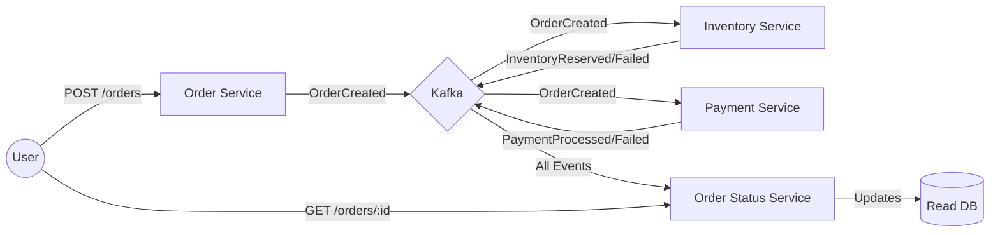

# Event-Driven Order Processing System

A distributed e-commerce system built with **Node.js** microservices, **Kafka** for event streaming, and **MySQL** for persistence.

## 🏗 Architecture

The system consists of 4 decoupled microservices:

1.  **Order Service** (Port `3000`)
    - **Role**: Accepts HTTP requests for new orders.
    - **Action**: Validates input and publishes `OrderCreated` events to Kafka.
    - **Stack**: Express.js, KafkaJS.

2.  **Inventory Service** (Background Worker)
    - **Role**: Manages product stock.
    - **Action**: Consumes `OrderCreated`. Checks database. Publishes `InventoryReserved` or `InventoryFailed`.
    - **Stack**: Node.js, MySQL2, KafkaJS.
    - **Feature**: Implements **Idempotency** (deduplication) using a `processed_events` table.

3.  **Payment Service** (Background Worker)
    - **Role**: Processes payments.
    - **Action**: Consumes `OrderCreated`. Mocks payment logic (70% success rate). Publishes `PaymentProcessed`.
    - **Stack**: Node.js, KafkaJS.

4.  **Order Status Service** (Port `3001`)
    - **Role**: Tracks the lifecycle of an order.
    - **Action**: Consumes ALL events (`OrderCreated`, `InventoryReserved`, `PaymentProcessed`, etc.) to update a unified "Read Model" database.
    - **Stack**: Express.js, MySQL2, KafkaJS.

### System Flow



## 🚀 Prerequisites

- **Docker & Docker Compose** (for Kafka, Zookeeper, MySQL)
- **Node.js** (v18 or higher)
- **Python 3** (for running the automated test suite)

---

## 🛠️ Setup & Installation

We support a **Hybrid Workflow**. You can run services locally while keeping infrastructure (Kafka/MySQL) in Docker, OR run everything in Docker.

### 1. Start Infrastructure

Regardless of your choice, you must start the core infrastructure first.

```bash
# Starts Zookeeper, Kafka, and MySQL databases
docker-compose up -d zookeeper kafka mysql-inventory mysql-orderstatus
```

### 2. Configure Environment

We have streamlined configuration. Each service has a `.env` file that supports **Local Development** by default.

```bash
# Copy example files (if you haven't already, though the repo comes with defaults)
# The default values in .env work out-of-the-box for Local Execution!
cp order-service/.env.example order-service/.env
cp inventory-service/.env.example inventory-service/.env
cp payment-service/.env.example payment-service/.env
cp order-status-service/.env.example order-status-service/.env
```

### 3. Choose Your Run Mode

#### Option A: Local Development (Recommended for coding)

Run each service in a separate terminal. They will connect to `localhost:9092` and the exposed MySQL ports.

**Ports**:

- Order Service: `http://localhost:3000`
- Order Status Service: `http://localhost:3001`
- MySQL Inventory: `localhost:3308` (Mapped to avoid conflict with local MySQL)
- MySQL OrderStatus: `localhost:3309`

```bash
# Terminal 1
cd order-service && npm install && npm run dev

# Terminal 2
cd inventory-service && npm install && npm run dev

# Terminal 3
cd payment-service && npm install && npm run dev

# Terminal 4
cd order-status-service && npm install && npm run dev
```

#### Option B: Full Docker Production (Recommended for testing)

Run the entire stack inside containers. The `docker-compose.yml` automatically overrides the `.env` settings to use internal naming (e.g., `kafka:29092`).

**Ports**:

- Order Service: `http://localhost:3005`
- Order Status Service: `http://localhost:3006`

```bash
docker-compose up -d --build
```

---

## 🧪 Testing

### Automated End-to-End Tests

Our Python test suite works against EITHER mode (Local or Docker).

```bash
cd tests
python -m venv .venv
./.venv/Scripts/Activate
pip install -r requirements.txt

# Run tests
pytest -v
```

> **Note**: If running against Docker, the tests automatically use ports 3005/3006. If running locally, you might need to adjust test URLs or just use Docker for E2E.

### Manual Verification (cURL)

**Local Mode**:

```bash
curl -X POST http://localhost:3000/api/orders \
  -H "Content-Type: application/json" \
  -d '{"user_id": "test-user", "items": [{"product_id": "prod-001", "quantity": 1}]}'
```

**Docker Mode**:

```bash
curl -X POST http://localhost:3005/api/orders \
  -H "Content-Type: application/json" \
  -d '{"user_id": "test-user", "items": [{"product_id": "prod-001", "quantity": 1}]}'
```

---

---

## 📚 API Reference

### 1. Create Order

**Endpoint**: `POST /api/orders`

- **Body**:
  ```json
  {
    "user_id": "user-123",
    "items": [{ "product_id": "prod-001", "quantity": 1 }]
  }
  ```
- **Response**: `202 Accepted` `{ "order_id": "..." }`

### 2. Get Order Status

**Endpoint**: `GET /api/orders/:order_id`

- **Response**:
  ```json
  {
    "order_id": "...uuid...",
    "status": "COMPLETED",
    "inventory_status": "RESERVED",
    "payment_status": "PROCESSED"
  }
  ```

---

## ⚠️ Troubleshooting

**1. "Address already in use" (Port Conflicts)**

- We remapped Docker MySQL ports to **3308** and **3309** to avoid conflicting with your local MySQL on 3306.
- Order Service maps to **3005** (Docker) vs **3000** (Local).

**2. Kafka Connection Errors**

- **Local**: Ensure `.env` says `KAFKA_BROKERS=localhost:9092`.
- **Docker**: Ensure `docker-compose.yml` overrides this to `kafka:29092` (This is handled automatically).
